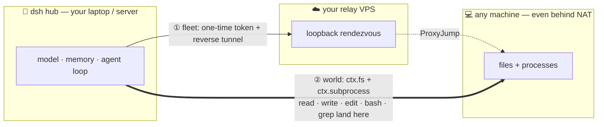

# dsh-anywhere

[](https://github.com/tangwenhao616-netizen/dsh-anywhere/actions/workflows/ci.yml)
[](https://www.npmjs.com/package/dsh-anywhere)
[](https://www.npmjs.com/package/dsh-anywhere)
[](LICENSE)
[](package.json)

> **Put your [DeepSeek Harness](https://github.com/deepseek-ai/deepseek-harness) workspace on _any_ machine.** Bring an off-site box online — even behind NAT — then let the agent `read` / `write` / `edit` / `bash` / `grep` **natively on that machine**, while the model, memory, and agent loop stay on your hub.

**English** · [简体中文](README.zh-CN.md)



Two composable modes in one plugin:

- **① fleet — reach it.** Enroll a machine behind NAT into your dph with a one-time token and a reverse tunnel to *your own* relay VPS. It shows up as a `fleet-*` `dsh-ssh` host, driven by the existing `ssh_exec` / `ssh_upload` tools.
- **② world — make it your workspace.** Turn any reachable machine into the session's `ctx.fs` + `ctx.subprocess`, so the agent's native file & shell tools operate on it. Same shape as the E2B integration — but the remote is any SSH-reachable host.

**Flagship combo (this is the "remote computer as workspace" story):** use **fleet** to pull in the NAT'd box, then **world** (`-o ProxyJump=<relay>`) to promote it to the whole session's workspace. If the target is already reachable (a cloud VM, a LAN box), just use **world** and skip fleet.

## Demo

A real agent session, driven through the published package, operating on a remote machine — it runs a shell command *there* and writes a file *there*:

```console
$ dsh --profile headless --patch ./workspace-on-machine.patch.yml \
    "run 'uname -n' and write MERGED-WORLD-OK to /tmp/selftest.txt"

▸ bash        uname -n
  VM-0-16-ubuntu                 ← the REMOTE host, not your laptop
▸ write       /tmp/selftest.txt  ← lands on the REMOTE machine
  MERGED-WORLD-OK

$ ssh you@remote 'cat /tmp/selftest.txt'   # verified independently
MERGED-WORLD-OK
```

> 📹 A screen recording of the `/fleet` enroll-and-approve flow is welcome — see [CONTRIBUTING](CONTRIBUTING.md).

## Quick Start (~5 min)

**Prerequisites:** a working dsh install, and system `ssh` on the hub. For *world* mode you also need a machine you can already `ssh` into (LAN, a cloud VM, or a fleet-enrolled box).

**1. Install** (peers `@deepseek-ai/dsh-fs` / `dsh-subprocess` are provided by dsh):

```sh
dsh plugin --profile <your-profile> add dsh-anywhere
```

**2a. World mode — put your workspace on a reachable machine.** Copy [`examples/workspace-on-machine.patch.yml`](examples/workspace-on-machine.patch.yml), fill in the target's `login` / `sshArgs` / `cwd`, then:

```sh
DSH_PERMISSION_MODE=danger-full-access \
  dsh --profile <your-profile> --patch ./workspace-on-machine.patch.yml "work on this machine"
```

Now `read` / `write` / `edit` / `bash` / `grep` all land on that machine.

**2b. Fleet mode — bring a NAT'd machine online.** Installing already mounts the `/fleet` panel. Point it at your relay (run [`scripts/relay-init.sh`](scripts/relay-init.sh) on your VPS once, then register it), click **Add machine**, run the one-liner on the target, and **approve** it in the panel. See [fleet mode](#mode-fleet--bring-a-machine-online) below.

> **⚠️ Install properly — do not `link:`.** At boot, a `--patch` `name:` resolves relative to the *profile directory*. A `link:` dev-install makes the **world** half fail with `ERR_MODULE_NOT_FOUND` (its `@deepseek-ai/dsh-fs` peer can't be resolved from the repo realpath). Use a real install (`dsh plugin add` / `npm i`, peers provided by the runtime), or drop a **real** `dsh-anywhere` directory into `<profile>/node_modules/` and symlink `@deepseek-ai/dsh-fs` + `dsh-subprocess` into `<profile>/node_modules/@deepseek-ai/` (same realpath so `extends FileSystem` uses the same class). The **fleet** half is zero-dependency and `link:` works.

## The two modes

|  | fleet (reach layer) | world (execution-world layer) |
|---|---|---|
| Job | make a NAT'd machine **reachable** | make a reachable machine **the whole workspace** |
| Machine appears as | a `dsh-ssh` host (`fleet-*`) | the session's `ctx.fs` + `ctx.subprocess` |
| You operate it with | `ssh_exec` / `ssh_upload` / `ssh_download` / `ssh_tunnel` | native `read` / `write` / `edit` / `bash` / `grep`, on the remote |
| Mounting | always-on once installed (`dsh.bundle` → `cordis.patch.yml`) | per session, `--patch workspace-on-machine.patch.yml` |
| Entry point | `dsh-anywhere` | `dsh-anywhere/world` |

- **Zero external npm deps** — files / processes / tunnels all go through the system `ssh` CLI (paths and contents are base64'd into the remote script, so no quoting or injection). `@deepseek-ai/dsh-fs` and `@deepseek-ai/dsh-subprocess` are **peerDependencies**, provided by the dsh runtime.
- **Fast** — world reuses one OpenSSH **ControlMaster** connection, so fs micro-ops are ~40 ms (no re-handshake per op). This is what makes working over a tunnel actually pleasant.
- **Cancellable** — long commands use a dedicated connection; `terminate()` drops it and sshd SIGHUPs the remote command.

<a name="mode-fleet--bring-a-machine-online"></a>
## Mode: fleet — bring a machine online

1. **Configure a relay** (the plugin never hard-codes your VPS): run [`scripts/relay-init.sh`](scripts/relay-init.sh) on your relay VPS, then register it via `POST /api/fleet/relay` (or in the `/fleet` panel).
2. **Add a machine:** the panel's **Add machine** gives a one-liner — run `curl <base>/join | bash` on the target (Windows: `irm '<base>/join?os=win' | iex`). The machine prints a pairing code and waits.
3. **Approve:** verify the pairing code and click **Approve** in `/fleet` (approval is accepted only from the local host). The machine's sshd is mapped to the relay's loopback via a reverse tunnel, and the hub reaches it over ProxyJump as a `fleet-*` `dsh-ssh` host.
4. List / revoke: `GET /api/fleet/list`, `POST /api/fleet/approve|reject|revoke`.

**Security:** one-time, expirable, per-machine-revocable tokens; a separate tunnel key per machine; the machine's sshd binds only the relay loopback and is **never exposed publicly**; approval is local-only.

## Mode: world — make it your workspace

See Quick Start 2a. What `world` provides:

| Capability | Implementation |
|---|---|
| `ctx.fs` (FileSystem) | fs-ssh: resolve / stat / lstat / readText / streamText / readBytes / listDir / writeText / editText — with version guards, atomic writes, binary/UTF-8 handling |
| `ctx.subprocess` (SubprocessRuntime) | subprocess-ssh: `resolveExecutable` / `spawn` (stdin · collect · exit code · cwd · env · terminate) / `spawnTerminal` (basic PTY via `ssh -tt`) |
| bash / grep / terminal / LSP | no changes needed — they are provider-neutral consumers of `ctx.fs` + `ctx.subprocess`, so they land on the remote automatically |

**One-world invariant:** `fs.cwd` == `subprocess.cwd` (the patch's `config.cwd`) == `sandbox-policy.workspaceRoot` == the session workspace — they must all point at the **same remote directory**, or relative paths and command cwds land on a path that doesn't exist remotely and spawns fail.

**Per-instance, not per-session:** a dsh execution world is per-instance (`ctx.fs`/`ctx.subprocess` are not scope-aware). To use a local workspace *and* a remote one at the same time, run **two dsh instances** (one local profile, one world profile). fleet mode has no such limit — an enrolled machine is a `dsh-ssh` host that coexists with your local workspace.

## Known limits (POC stage)

- `spawnTerminal` is a basic PTY; precise remote foreground-process-group query/signalling and full TERM→KILL quiescing aren't implemented yet.
- Each fs op is one remote round-trip (ControlMaster removes the handshake; huge bursts still pay per-op ssh process cost).
- The remote needs `rg` (ripgrep) for the agent's `grep`/`glob` to run at full speed; otherwise it falls back to `grep`/`find`.
- world's `ctx.fs` is not wired to dsh's sandbox fence (use `danger-full-access`; the fence is delegated to the remote account itself).

## Contributing

Issues and PRs welcome — see [CONTRIBUTING.md](CONTRIBUTING.md). Tests: `node --test` (integration tests auto-skip unless you set `DSH_ANYWHERE_RELAY=user@host`).

## License

[MIT](LICENSE)
