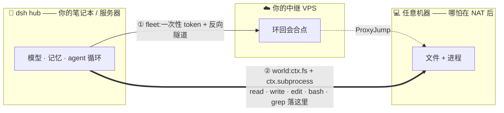

# dsh-anywhere

[](https://github.com/tangwenhao616-netizen/dsh-anywhere/actions/workflows/ci.yml)
[](https://www.npmjs.com/package/dsh-anywhere)
[](https://www.npmjs.com/package/dsh-anywhere)
[](LICENSE)
[](package.json)

> **把你的 [DeepSeek Harness](https://github.com/deepseek-ai/deepseek-harness) 工作区落在_任意_一台机器上。** 把异地机器(哪怕在 NAT 后)拉上线,让 agent 的 `read` / `write` / `edit` / `bash` / `grep` **原生作用在那台机器上**,而模型、记忆、agent-loop 全留在 hub。

[English](README.md) · **简体中文**



一个插件,两种可组合的模式:

- **① fleet —— 够得着。** 用一次性 token + 反向隧道,把 NAT 后的机器拉进你的 dph,连到_你自己的_中继 VPS。它作为一条 `fleet-*` 的 `dsh-ssh` 主机出现,用现成的 `ssh_exec` / `ssh_upload` 工具操作。
- **② world —— 变工作区。** 把任意可达机器变成会话的 `ctx.fs` + `ctx.subprocess`,agent 的原生文件/命令工具就作用在它上面。与 dsh 的 E2B 集成同构,只是远端换成任意 SSH 可达的机器。

**旗舰组合(就是"异地电脑当工作区"这件事):** 先用 **fleet** 把 NAT 后的机器拉进来,再用 **world**(`-o ProxyJump=<relay>`)把它升格为整会话工作区。目标本就可达(公网云主机 / 局域网)时,直接用 **world**、跳过 fleet。

## 演示

一段真实 agent 会话(经已发布的包驱动),在一台远程机器上干活 —— 命令在那台机器上跑、文件写在那台机器上:

```console
$ dsh --profile headless --patch ./workspace-on-machine.patch.yml \
    "跑 'uname -n' 并把 MERGED-WORLD-OK 写进 /tmp/selftest.txt"

▸ bash        uname -n
  VM-0-16-ubuntu                 ← 远程主机,不是你的笔记本
▸ write       /tmp/selftest.txt  ← 落在远程机器上
  MERGED-WORLD-OK

$ ssh you@remote 'cat /tmp/selftest.txt'   # 独立核验
MERGED-WORLD-OK
```

> 📹 欢迎补一段 `/fleet` 申请-批准流程的录屏 —— 见 [CONTRIBUTING](CONTRIBUTING.md)。

## 快速开始(约 5 分钟)

**前置:** 可用的 dsh、hub 上有系统 `ssh`。world 模式还需要一台你已经能 `ssh` 上去的机器(局域网、云主机,或 fleet 入网的机器)。

**1. 安装**(peer `@deepseek-ai/dsh-fs` / `dsh-subprocess` 由 dsh 提供):

```sh
dsh plugin --profile <你的profile> add dsh-anywhere
```

**2a. world 模式 —— 把工作区落到一台可达机器。** 复制 [`examples/workspace-on-machine.patch.yml`](examples/workspace-on-machine.patch.yml),填好目标机的 `login` / `sshArgs` / `cwd`,然后:

```sh
DSH_PERMISSION_MODE=danger-full-access \
  dsh --profile <你的profile> --patch ./workspace-on-machine.patch.yml "在这台机器上干活"
```

此时 `read` / `write` / `edit` / `bash` / `grep` 全部落在那台机器。

**2b. fleet 模式 —— 把 NAT 后机器拉上线。** 装上即挂载 `/fleet` 面板。指向你的中继(在 VPS 上跑一次 [`scripts/relay-init.sh`](scripts/relay-init.sh) 再登记),点「加机器」,在目标机跑那行命令,回面板**批准**。详见下方 [fleet 模式](#fleet-模式--把机器拉上线)。

> **⚠️ 务必正式安装,别 `link:`。** boot 时 `--patch` 里的 `name:` 是**相对 profile 目录**解析的。用 `link:` 开发装会让 **world 半边**因 `@deepseek-ai/dsh-fs` peer 从仓库 realpath 解析不到而报 `ERR_MODULE_NOT_FOUND`。用正式安装(`dsh plugin add` / `npm i`,peer 由运行时提供),或把**真实目录** `dsh-anywhere` 放进 `<profile>/node_modules/` 并把 `@deepseek-ai/dsh-fs`、`dsh-subprocess` 软链进 `<profile>/node_modules/@deepseek-ai/`(同一 realpath,`extends FileSystem` 才是同一个类)。**fleet 半边零依赖,`link:` 可用。**

## 两种模式一张表

|  | fleet(组网层) | world(执行世界层) |
|---|---|---|
| 职责 | 让 NAT 后的机器**够得着** | 把可达机器变成**整个工作区** |
| 机器呈现为 | 一条 `dsh-ssh` 主机(`fleet-*`) | 会话的 `ctx.fs` + `ctx.subprocess` |
| 操作方式 | `ssh_exec` / `ssh_upload` / `ssh_download` / `ssh_tunnel` | 原生 `read` / `write` / `edit` / `bash` / `grep`,落远程 |
| 挂载 | 装插件即常驻(`dsh.bundle` → `cordis.patch.yml`) | 每会话 `--patch workspace-on-machine.patch.yml` |
| 入口 | `dsh-anywhere` | `dsh-anywhere/world` |

- **零外部 npm 依赖** —— 文件/进程/隧道都走系统 `ssh` CLI(路径与内容 base64 进远程脚本,无引号/注入)。`@deepseek-ai/dsh-fs`、`@deepseek-ai/dsh-subprocess` 是 **peerDependencies**,由 dsh 运行时提供。
- **快** —— world 复用一条 OpenSSH **ControlMaster** 连接,fs 微操作 ≈40ms(不是每次重握手)。这正是让"经隧道在异地机器上干活"流畅可用的关键。
- **可取消** —— 长命令用专用连接,`terminate()` 断连即由 sshd SIGHUP 远端命令。

<a name="fleet-模式--把机器拉上线"></a>
## fleet 模式 —— 把机器拉上线

1. **配中继**(插件不硬编码你的 VPS):在中继 VPS 跑 [`scripts/relay-init.sh`](scripts/relay-init.sh),再经 `POST /api/fleet/relay`(或 `/fleet` 面板)登记。
2. **加机器:** 面板「加机器」给一行命令 —— 目标机跑 `curl <base>/join | bash`(Windows:`irm '<base>/join?os=win' | iex`)。机器显示**配对码**并挂起。
3. **批准:** 核对配对码后在 `/fleet` 点「通过」(只认本机来源)。机器 sshd 经反向隧道映射到中继环回口,hub 经 ProxyJump 够到它,作为 `fleet-*` dsh-ssh 主机上线。
4. 列表/吊销:`GET /api/fleet/list`、`POST /api/fleet/approve|reject|revoke`。

**安全:** token 一次性 + 可过期 + 可单台吊销;每台机器独立隧道密钥;机器 sshd 只绑中继环回口、**不暴露公网**;审批只认本机来源。

## world 模式 —— 把机器变工作区

见快速开始 2a。world 提供:

| 能力 | 实现 |
|---|---|
| `ctx.fs`(FileSystem) | fs-ssh:resolve / stat / lstat / readText / streamText / readBytes / listDir / writeText / editText;版本守卫、原子写、二进制/UTF-8 |
| `ctx.subprocess`(SubprocessRuntime) | subprocess-ssh:`resolveExecutable` / `spawn`(stdin · collect · 退出码 · cwd · env · terminate)/ `spawnTerminal`(基础 PTY,`ssh -tt`) |
| bash / grep / 终端 / LSP | 无需改动 —— 它们是 `ctx.fs`+`ctx.subprocess` 的 provider-neutral consumer,自动落远程 |

**一世界不变式:** `fs.cwd` == `subprocess.cwd`(补丁 `config.cwd`)== `sandbox-policy.workspaceRoot` == 会话工作区,必须**同指一个远程目录**;否则相对路径与命令 cwd 会落到远端不存在的路径而报 spawn 失败。

**Windows 远端:** 远端是 Windows(OpenSSH + PowerShell)时,给 `ssh-world` config 加 `platform: windows`——fs/subprocess 改走 **PowerShell 后端**(全 base64、二进制安全)——并把 `cwd` / `workspaceRoot` 用 Windows 路径(如 `C:\Users\you\work`)。默认 `platform: posix`(Linux/macOS)。已对真实 Windows 主机端到端验证。注意:Windows OpenSSH 会把非零退出码塌掉,精确码经带外标记还原;远端有 `rg` 才能让 `grep` 满速。

**每实例,非每会话:** dsh 执行世界是每实例的(`ctx.fs`/`ctx.subprocess` 非 scope-aware)。要同时用本地与远程工作区,就**跑两个 dsh 实例**(一个本地 profile、一个 world profile)。fleet 模式不受此限 —— 入网机器是 dsh-ssh 主机,可与本地工作区并存。

## 已知限制(POC 阶段)

- `spawnTerminal` 为基础 PTY;远端前台进程组精确查询/信号、TERM→KILL 完整静默尚未实现。
- 每次 fs 操作是一次远程往返(ControlMaster 已消掉握手;超大量微操作仍有 per-op ssh 进程开销)。
- 远程需有 `rg`(ripgrep)才能让 agent 的 `grep`/`glob` 满速;缺则降级 `grep`/`find`。
- world 的 `ctx.fs` 未接 dsh 沙箱围栏(用 `danger-full-access`;围栏交给远端账号本身)。

## 参与贡献

欢迎 issue / PR —— 见 [CONTRIBUTING.md](CONTRIBUTING.md)。测试:`node --test`(集成测试在未设 `DSH_ANYWHERE_RELAY=user@host` 时自动跳过)。

## 许可

[MIT](LICENSE)
